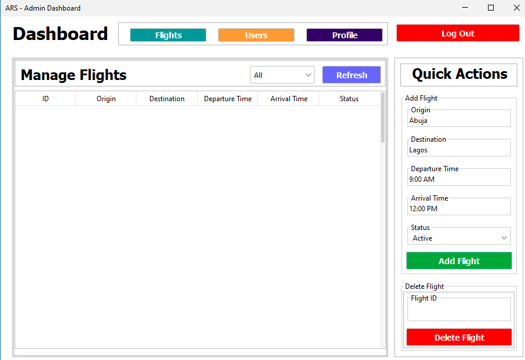
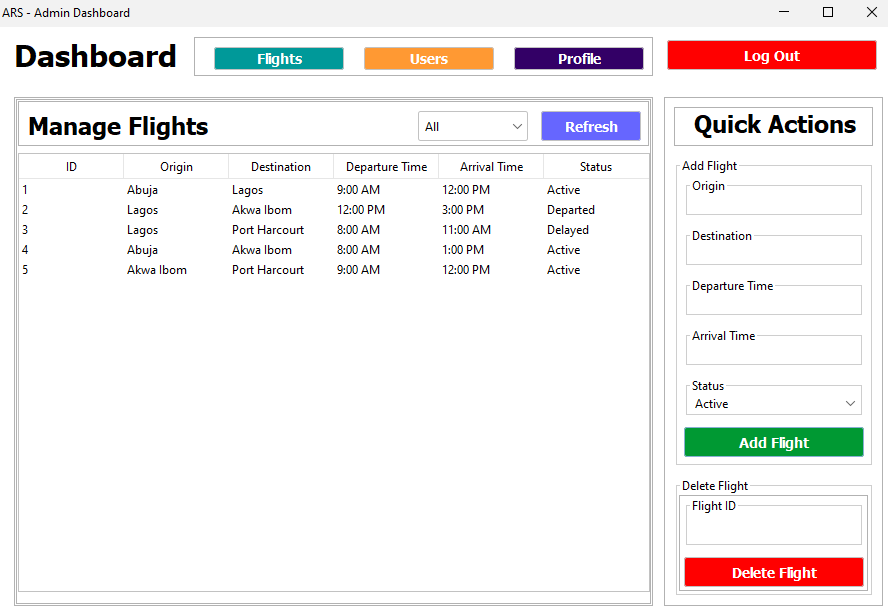
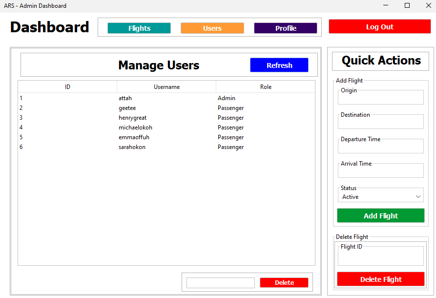
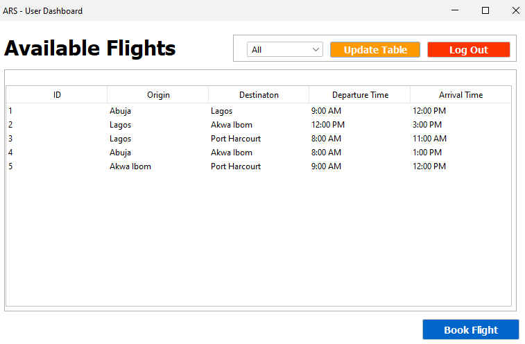

# Airline Reservation System (ARS)

A simple flight-booking application built with Java Swing and PostgreSQL database.

## Description

The Airline Reservation System (ARS) is a desktop application that allows users to register, login, and book flights. It features separate dashboards for regular users and administrators, with functionality to manage flights and user accounts.

## Features

- **User Registration and Authentication**: Users can register and login with username/password
- **Role-based Access**: Supports user and admin roles with different permissions
- **Flight Management**: Admins can add new flights
- **User Dashboard**: Users can view available flights
- **Admin Dashboard**: Admins can manage flights and potentially users
- **Modern UI**: Uses FlatLaf for a clean, modern look and feel

## Prerequisites

- Java 8 or higher
- PostgreSQL database
- NetBeans IDE (recommended for development)

## Installation

1. Clone or download the project
2. Open the project in NetBeans IDE
3. Ensure the required libraries are in the `lib/` folder:
   - FlatLaf 3.6
   - PostgreSQL JDBC Driver 42.7.7
4. Ensure the default profile image is present in `src/icons/` (the application requires a profile image file named exactly as expected by the code to avoid runtime errors. The image is: src\icons\IMG20250328064620@-2043910282.jpg)

## Database Setup

1. Create a PostgreSQL database named `flightsdb`
2. Set up environment variables for database credentials:
   - `DB_USER`: Your PostgreSQL username
   - `DB_PASS`: Your PostgreSQL password
3. Create the required tables:

```sql
CREATE TABLE users (
    id SERIAL PRIMARY KEY,
    username VARCHAR(50) UNIQUE NOT NULL,
    password VARCHAR(255) NOT NULL,
    role VARCHAR(20) NOT NULL
);

CREATE TABLE flights (
    id SERIAL PRIMARY KEY,
    origin VARCHAR(100) NOT NULL,
    destination VARCHAR(100) NOT NULL,
    departure_time TIMESTAMP NOT NULL,
    arrival_time TIMESTAMP NOT NULL,
    status VARCHAR(20) NOT NULL
);
```

## Running the Application

1. Build the project in NetBeans
2. Run the `Main.java` file
3. The application will start with the login form

## Usage

1. **Registration**: New users can register through the registration form
2. **Login**: Existing users login with their credentials
3. **User Dashboard**: After login, users can view available flights
4. **Admin Dashboard**: Admins have additional privileges to manage flights

## Technologies Used

- **Java**: Core programming language
- **Swing**: GUI framework
- **FlatLaf**: Modern look and feel library
- **PostgreSQL**: Database management system
- **JDBC**: Database connectivity

## Project Structure

```
src/
├── ars/
│   ├── db/
│   │   ├── DBHelper.java      # Database connection utility
│   │   ├── UsersDAO.java      # User data access object
│   │   └── FlightsDAO.java    # Flight data access object
│   └── ui/
│       ├── Main.java          # Application entry point
│       ├── LoginForm.java     # Login interface
│       ├── RegisterForm.java  # Registration interface
│       ├── UserDashboard.java # User dashboard
│       └── AdminDashboard.java # Admin dashboard
```

## Project Samples

**Adding Flights:**


**Viewing Flights:**


**Managing Users:**


**Booking Flights (on the user end):**



## License

This project is licensed under the terms specified in the LICENSE file.
